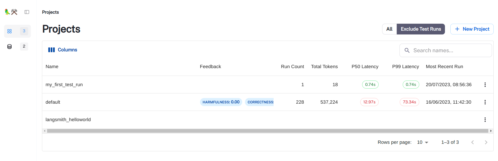

# LangSmith Announcement
  [LangChain announced `LangSmith` on Jul 18, 2023](https://blog.langchain.dev/announcing-langsmith/)

# LangSmith Walkthrough

Follow the `walkthrough` to config the environment variables:
- [Walkthrough notebook](https://github.com/hwchase17/langchain/blob/master/docs/extras/guides/langsmith/walkthrough.ipynb)
- [Walkthrough Doc](https://python.langchain.com/docs/guides/langsmith/walkthrough)

Environment variables to config:
```text
export LANGCHAIN_TRACING_V2=true
export LANGCHAIN_ENDPOINT="https://api.smith.langchain.com"
export LANGCHAIN_API_KEY="<your-api-key>"
export LANGCHAIN_PROJECT="my_first_test_run"
```

# Example Project 
Example code
- [run_langsmith_example](run_langsmith_example.py)

Example logs
[LangSmith Project Page](https://smith.langchain.com/)



